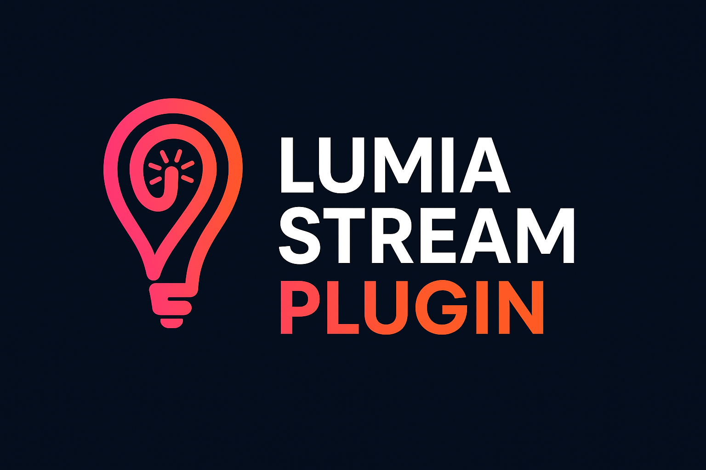

# Lumia Stream Plugin SDK

Official JavaScript SDK for developing plugins for [Lumia Stream](https://lumiastream.com).



## Installation

```bash
npm install @lumiastream/plugin
```

## Usage

```js
import { Plugin } from "@lumiastream/plugin";

export default class MyPlugin extends Plugin {
	constructor(manifest, context) {
		super(manifest, context);
	}

	async onload() {
		// Plugin loaded
	}

	async onunload() {
		// Plugin unloaded
	}
}
```

JavaScript (`.js`) is the default runtime path for plugins.

## Plugin Manifest

Every plugin requires a `manifest.json` file that describes your plugin, its metadata, and configuration:

```json
{
	"id": "my_awesome_plugin",
	"name": "My Awesome Plugin",
	"version": "1.0.0",
	"author": "Your Name",
	"description": "A brief description of what your plugin does",
	"lumiaVersion": "^9.0.0",
	"category": "utilities",
	"config": {
		"hasAI": true,
		"hasChatbot": true,
		"modcommandOptions": ["delete", "ban", "timeout"],
		"settings": [
			{
				"key": "apiKey",
				"label": "API Key",
				"type": "text",
				"required": true
			}
		]
	}
}
```

## Lifecycle Hooks

- `onload()` – invoked when the plugin is enabled inside Lumia Stream.
- `onunload()` – called when your plugin is disabled or unloaded.
- `onupdate(oldVersion, newVersion)` – triggered after version upgrades.
- `onsettingsupdate(settings, previousSettings)` – called whenever settings change.
- `actions(config)` – handle custom actions invoked from Lumia automations.  
  **Note:** action parameters are provided via `action.value`. Use `const params = action.value;`.
- `aiPrompt(config)` – optional AI prompt handler used when `config.hasAI` is enabled in your manifest.
- `aiModels(config?)` – optional AI model provider used by Lumia model pickers when `config.hasAI` is enabled.
- `chatbot(config)` – optional native chatbot handler used when `config.hasChatbot` is enabled in your manifest.
- `modCommand(type, value)` – optional moderation handler used when `config.modcommandOptions` is declared in your manifest.
- `searchLights(config)` – optional hook for lights plugins to return discoverable devices in the auth UI.
- `addLight(config)` – optional hook for manual light add flows; return the updated light list.
- `removeLight(config)` – optional hook for manual light removal flows; return the updated light list.
- `searchPlugs(config)` – optional hook for plug/accessory plugins to return discoverable plugs in the auth UI.
- `addPlug(config)` – optional hook for manual plug add flows; return the updated plug list.
- `removePlug(config)` – optional hook for manual plug removal flows; return the updated plug list.
- `searchThemes(config)` – optional hook for lights plugins to return Studio theme options (array or `{ scenes|effects|presets }` object).
- `onLightChange(config)` – optional runtime hook for light updates and Studio theme executions (`config.rawConfig.theme` when invoked from themes).
- `onPlugChange(config)` – optional runtime hook for plug state updates (`config` includes `brand`, `devices`, `state`, `rawConfig`).

## Lights, Plugs, And Studio Themes

If your plugin is a lights integration:

- implement `searchLights` and/or `addLight` for light selection in auth
- implement `removeLight` if users should be able to remove manually added lights from auth
- implement `onLightChange` to apply runtime light changes
- implement `searchThemes` to surface mode/scene options in Studio themes
- set `config.themeConfig` in `manifest.json` to control which Studio bucket (`scenes`, `effects`, or `presets`) Lumia should use

If your plugin is a plug/accessory integration:

- implement `searchPlugs` and/or `addPlug` for plug selection in auth
- implement `removePlug` if users should be able to remove manually added plugs from auth
- implement `onPlugChange` to apply runtime on/off updates
- add a `config.plugs` block in `manifest.json` to render plug discovery/manual-add UI

## Lumia API Highlights

Interact with Lumia Stream using the strongly typed `ILumiaAPI` helper on the plugin context:

```js
await this.lumia.triggerAlert({
    alert: "follow",
    extraSettings: { username: "StreamerFan" },
    showInEventList: false,
});
await this.lumia.playAudio({ path: "alert.mp3", volume: 0.7 });
this.lumia.setVariable("follower_count", 1337);
this.lumia.displayChat({
    username: "Viewer123",
    message: "Hello from the plugin!",
});
```

`showInEventList` should stay `false` for most plugins. Enable it only when users expect those plugin-triggered events in Event List (typically streaming platform/event-source plugins).

See the [API reference](./api-reference) for the full surface area.

### Shared Runtime Resources

Plugins can share heavy resources (for example OpenCV/ONNX runtimes) across the plugin host process:

```js
const sharedCv = await this.lumia.acquireShared("opencv.runtime", () => {
    return require("@lumiastream/opencv-runtime");
}, {
    dispose: (runtime) => runtime?.shutdown?.(),
});
// ...use sharedCv...
await this.lumia.releaseShared("opencv.runtime");
```

Notes:
- The first plugin call for a key should provide `factory`.
- Later plugins can call `acquireShared(key)` to reuse the same instance.
- If a plugin unloads without releasing, Lumia auto-releases its remaining references.

For Bluetooth plugins using `@abandonware/noble`, use the shared noble helper instead of loading noble separately in each plugin:

```js
const ble = await this.lumia.acquireSharedNoble();
await ble.waitForPoweredOn(15000);
const unsubscribe = ble.onDiscover((peripheral) => {
    // handle BLE peripheral discovery
});
await ble.startScanning({
    serviceUuids: ["180d"], // optional
    allowDuplicates: false,
});
// ... later
await ble.stopScanning();
unsubscribe();
await this.lumia.releaseSharedNoble();
```

Notes:
- `acquireSharedNoble()` defaults to key `bluetooth.runtime.noble.manager.v1`.
- Scan/listener controls are plugin-scoped, so plugins can share one adapter runtime without fighting over scan state.

## Runtime Environment

Plugins execute in an isolated **Node.js** process (no browser DOM). Use Node-compatible packages and avoid browser-only APIs like `window`, `document`, `localStorage`, or `XMLHttpRequest`. Bundle or ship your dependencies with the plugin; do not assume Lumia provides third-party packages unless documented.

## Scripts

- `npm run build` – compile the SDK to the `dist` folder.
- `npm run lint` – type-check the source without emitting output.
- `npm run package-docs` – rebuild the GPT knowledge pack in `gpt-knowledge/lumia-plugin-sdk-docs`.
- `npm run sync:developer-docs` – sync core SDK docs and generated example pages into `../Developer-Docs/docs/plugin-sdk` (no manual copy/paste).
- `npm run sync:skills` – refresh Codex skill docs snapshot, Claude skill docs snapshot, and Cursor rules together.
- `npm run validate:skills` – validate Codex skill + Claude skill + Copilot instructions + Gemini instructions + Cursor rule version alignment.
- `npm run update:skills -- --target <plugin-path>` – pull latest skill files (Claude/Copilot/Gemini/Cursor, optional Codex) from `main`.

## CLI Helpers

The CLI is distributed separately via `lumia-plugin`. Use it with `npx` (requires npm 7+).

- `npx lumia-plugin create my_plugin` scaffold a feature-rich sample plugin showing logging, variables, and alerts
- `npx lumia-plugin validate ./path/to/plugin` check `manifest.json`, entry files, and config for common mistakes
- `npx lumia-plugin build ./path/to/plugin --out ./plugin.lumiaplugin` bundle the directory into a distributable archive

## Skills Support (Codex + Claude + Copilot + Gemini CLI + Cursor)

This repository ships cross-tool guidance for all supported tools using this repo as source:

- [https://github.com/lumiastream/Plugin-SDK](https://github.com/lumiastream/Plugin-SDK)

### Easy Install (Recommended)

Install all supported skills (Claude + Copilot + Gemini + Cursor + Codex):

```bash
npx lumia-plugin skills --target /path/to/your-plugin
```

Install one specific tool:

```bash
npx lumia-plugin skills claude --target /path/to/your-plugin
npx lumia-plugin skills copilot --target /path/to/your-plugin
npx lumia-plugin skills gemini --target /path/to/your-plugin
npx lumia-plugin skills cursor --target /path/to/your-plugin
npx lumia-plugin skills codex
```

Optional Codex home override:

```bash
npx lumia-plugin skills codex --codex-home "$CODEX_HOME"
```

List available skill bundles:

```bash
npx lumia-plugin skills list
```

### Codex Desktop: Enable And Use

Codex skill files install to `$CODEX_HOME/skills` (or `~/.codex/skills` when `CODEX_HOME` is not set).

1. Install Codex skill files:
```bash
npx lumia-plugin skills codex
```
2. Restart Codex Desktop (or open a new thread).
3. Invoke the skill in your prompt:
```text
$lumia-plugin-codex-skill
```
4. Example:
```text
Use $lumia-plugin-codex-skill to validate my plugin manifest and required hooks.
```

### Easy Updates (No Full Redownload)

Run the same command again to update to latest skill files:

```bash
npx lumia-plugin skills --target /path/to/your-plugin
```

Optional tool selection:

```bash
npx lumia-plugin skills --tools claude,copilot,gemini,cursor --target /path/to/your-plugin
```

Optional Codex skill update (for Codex Desktop install path):

```bash
npx lumia-plugin skills codex
npx lumia-plugin skills codex --codex-home "$CODEX_HOME"
```

### Automatic Sync on Publish

- `npm run sync:skills`
- `npm run validate:skills`
- `prepublishOnly` runs both before publish (covers Codex + Claude + Copilot + Gemini CLI + Cursor)

## Documentation

- [Getting Started](./getting-started)
- [API Reference](./api-reference)
- [Manifest Guide](./manifest-guide)
- [Field Types Reference](./field-types-reference)

## Examples

- `examples/base_plugin` – Showcase JavaScript template used by `npx lumia-plugin create`.
- `examples/divoom_pixoo` – Device plugin that sends text, GIFs, drawings, and controls to Divoom Pixoo displays.
- `examples/elevenlabs_tts` – Audio plugin that generates ElevenLabs speech/music and plays it through Lumia.
- `examples/eveonline` – EVE Online integration that syncs character status, wallet, location, and activity from ESI.
- `examples/minecraft_server` – Game plugin that monitors Minecraft Java server status/player changes.
- `examples/ntfy` – App plugin that subscribes to ntfy topics and triggers Lumia alerts/variables.
- `examples/ollama` – App plugin that queries a local Ollama server and exposes prompt helpers for templates.
- `examples/openrgb` – Lights plugin that controls OpenRGB devices and profile actions from Lumia.
- `examples/rumble` – Platforms plugin that tracks Rumble livestream state, engagement, and chat metadata.
- `examples/sound_trigger_alert` – Sound Trigger Alert example that matches a user-uploaded reference sound against live capture and triggers Lumia alerts.
- `examples/settings_field_showcase` – Reference plugin demonstrating all supported settings field types.
- `examples/steam` – Steam integration that tracks profile status, games, and achievements with optional alerts/actions.

## License

The SDK is released under the MIT License. See [LICENSE](https://github.com/lumiastream/Plugin-SDK/blob/main/LICENSE) for details.
